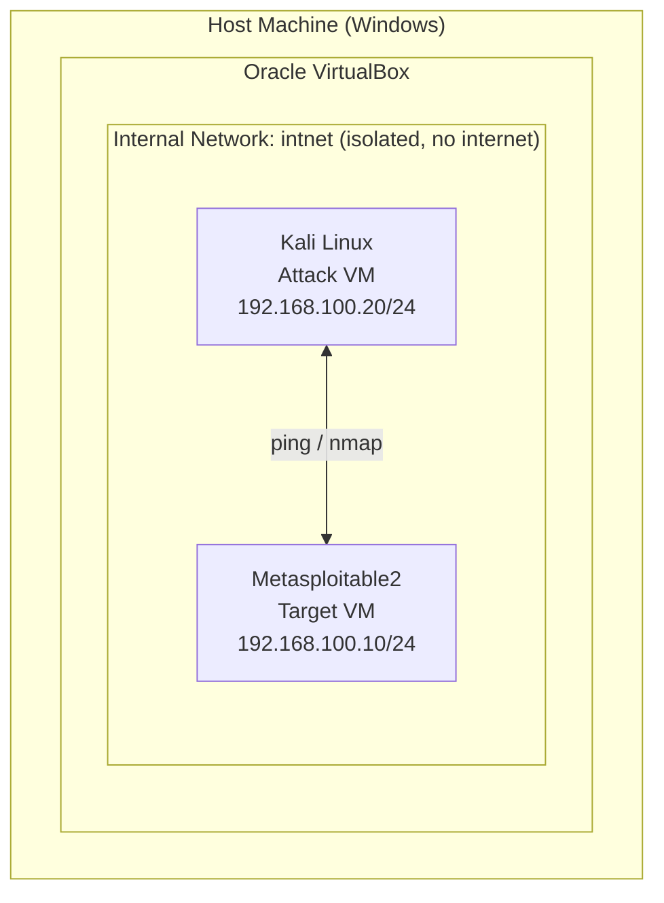

# Project 1: Home Lab Setup

Built a small, isolated penetration-testing lab using VirtualBox: a Kali Linux attack machine and a deliberately vulnerable Metasploitable2 target, both on a private internal network with no route to the internet or the host's home network.

## Goal

Learn to build and network virtual machines safely — the foundation every later project in this roadmap runs on.

## Environment

| Component | Details |
|---|---|
| Hypervisor | Oracle VirtualBox |
| Attack VM | Kali Linux 2024.3 (installed from official ISO) — 4096 MB RAM, 2 vCPU, 30 GB disk |
| Target VM | Metasploitable2 (pre-built vulnerable image) — 512 MB RAM, 8 GB disk |
| Network | VirtualBox Internal Network (`intnet`) — isolated from host & internet |

## Network Diagram



The `intnet` Internal Network exists only inside VirtualBox — it has no link to the host's real network adapter or the internet, so the intentionally-vulnerable target VM is never exposed outside the lab.

## Setup Steps

### 1. Install VirtualBox
Downloaded and installed Oracle VirtualBox on the host machine.

### 2. Create & Install Kali Linux (Attack VM)
- Created a new VM in VirtualBox: 4096 MB RAM, 2 CPUs, 30 GB dynamically allocated disk.
- Booted from the official `kali-linux-2024.3-installer-amd64.iso` and ran the graphical installer.
- Configured language/locale, hostname (`kali`), user account, and guided disk partitioning ("All files in one partition").
- Installed the GRUB bootloader to `/dev/sda`.
- Installed the default Xfce desktop environment plus Kali's recommended tool collection.

### 3. Import Metasploitable2 (Target VM)
- Downloaded `Metasploitable2-Linux.zip` and extracted the pre-built `Metasploitable.vmdk`.
- Created a new VM (512 MB RAM, "Other Linux 64-bit") and attached the existing `.vmdk` as its disk instead of creating a new one.
- Default credentials: `msfadmin` / `msfadmin`.

### 4. Isolate Both VMs on an Internal Network
- In each VM's **Settings → Network → Adapter 1**, set **Attached to: Internal Network**, name `intnet` (must match exactly on both VMs).
- VirtualBox's Internal Network has no DHCP server by default, so static IPs were assigned manually:
  - **Metasploitable2** (`eth0`):
    ```
    sudo ifconfig eth0 192.168.100.10 netmask 255.255.255.0 up
    ```
  - **Kali Linux** (`eth0`, managed by NetworkManager — a plain `ip addr add` doesn't persist, so the connection profile was configured instead):
    ```
    sudo nmcli connection modify "Wired connection 1" ipv4.method manual ipv4.addresses 192.168.100.20/24
    sudo nmcli connection up "Wired connection 1"
    ```

### 5. Verify Connectivity
From Kali:
```
$ ping 192.168.100.10
PING 192.168.100.10 (192.168.100.10) 56(84) bytes of data.
64 bytes from 192.168.100.10: icmp_seq=1 ttl=64 time=11.2 ms
64 bytes from 192.168.100.10: icmp_seq=2 ttl=64 time=0.454 ms
64 bytes from 192.168.100.10: icmp_seq=3 ttl=64 time=0.537 ms

--- 192.168.100.10 ping statistics ---
3 packets transmitted, 3 received, 0% packet loss, time 2022ms
```

0% packet loss — Kali can reach Metasploitable2, and the lab is fully isolated from the outside network.

## Key Learnings

- VirtualBox's **Internal Network** mode is the right choice for isolating intentionally vulnerable machines, but it ships with no DHCP — static IPs (or a custom DHCP server) are required.
- On modern Debian/Kali installs, NetworkManager owns the interface; low-level commands like `ip addr add` get silently reverted. Static configuration has to go through `nmcli connection modify` on the actual connection profile so it persists and doesn't fight with NetworkManager.
- Guided partitioning in the Debian/Kali installer must explicitly select a partitioning **scheme** (e.g. "All files in one partition") — skipping that step leaves no root filesystem defined and the installer errors out.

## Next

[Project 2: Linux & CLI Practice](../project-02-linux-cli-practice) — TryHackMe's Linux Fundamentals and Networking Fundamentals rooms.
